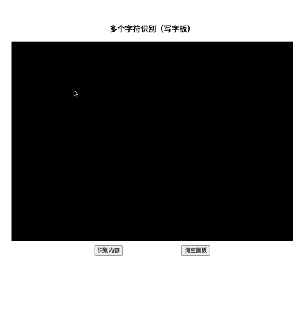
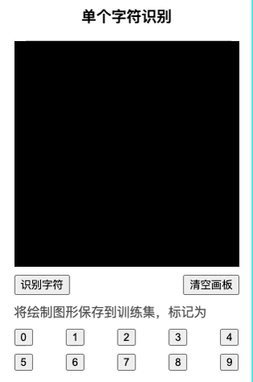
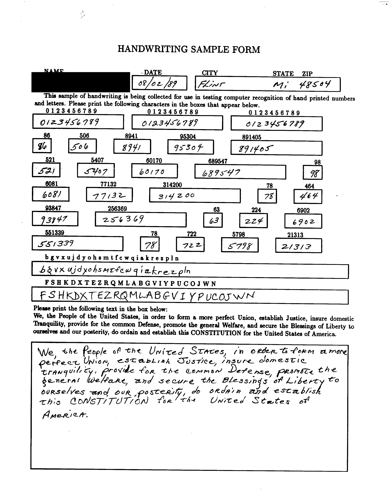

# 轻量级英文手写识别+数字手写识别

## 效果展示:

web端效果，字符串识别



当识别错误，可将数据自动归为训练样本。也可以用这个方法，制作自己的样本。



训练后的模型，会生成一份可在安卓单机识别的tflite文件。


## 硬件要求：

```
无GPU要求，普通笔记本即可训练和推理
内存>4G
CPU>2核
```

## 特色说明：

```
1、采用TensorFlow，支持跨平台，对硬件无要求，cpu、gpu都可以训练和推理。
2、支持多字符识别，0~9、A~Z、a~z，共62分类。
3、训练模型，多种精度保存和调用，服务端客户端都可以用。tflite支持安卓、树莓派等嵌入式设备单机识别。
```

## 项目说明：


write_ocr 服务端项目
```
write_ocr
  -- char_model.py  字符模型
  -- char_train.py  字符训练
  -- nist2datasets.py  数据集生成
  -- app.py  接口/启动页面
```

tflite 安卓端项目
```
tflite
  -- app/src/main/assets/char.tflite  模型文件
  -- java
    -- TFLiteTool.java TFLite工具类,读取模型文件并预测
    -- WriteActivity.java  安卓端识别类
```

## 操作方法：

```
### 1、依赖包安装requirements.txt

python -m pip install -r requirements.txt

### 2、将数据集放入 datasets 文件夹下
datasets
  -- char_train
    -- 字符a分类文件夹
      -- 1.jpg
    -- 字符b分类文件夹
      -- 2.jpg
  -- char_valid
    -- 字符a分类文件夹
    -- 字符b分类文件夹

### 3、执行训练
python char_train.py 

### 4、启动服务
启动命令 uvicorn app:app --host 0.0.0.0 --port 9001 --reload

### 5、访问地址
对外接口 http://127.0.0.1:9001/docs
单字符识别 http://127.0.0.1:9001/web/write_char.html
写字板多字符识别 http://127.0.0.1:9001/web/write_string.html

### 6、安卓端使用

只需要在build.gradle中添加tensorflow-lite支持
implementation 'org.tensorflow:tensorflow-lite:2.5.0'

android 下载配置不要压缩tflite文件
    aaptOptions {
        noCompress "tflite"
    }
```

## 数据集来源：
```
NIST 手印表格和字符数据库
下载地址 https://www.nist.gov/srd/nist-special-database-19
来自 3600 名作者的全页 HSF 表格，单独的数字、大小写和自由文本字段，超过 800,000 张经过手工检查分类的图像。
```



## 网络模型结构：

```
model = Sequential([
    layers.Rescaling(1./255, input_shape=(img_height, img_width, 1)),
    layers.Conv2D(16, 3, padding='same', activation='relu'),
    layers.MaxPooling2D(),
    layers.Conv2D(32, 3, padding='same', activation='relu'),
    layers.MaxPooling2D(),
    layers.Conv2D(64, 3, padding='same', activation='relu'),
    layers.MaxPooling2D(),
    layers.Dropout(0.1),
    layers.Flatten(),
    layers.Dense(128, activation='relu'),
    layers.Dense(num_classes)
])

```

> 代码来源
https://tensorflow.google.cn/tutorials/images/classification?hl=zh-cn


## 分类说明

```
python下使用十六进制数字转字符

class_names = ['30', '31', '32', '33', '34', '35', '36', '37', '38', '39',  # 0-9
               '41', '42', '43', '44', '45', '46', '47', '48', '49', '4a',  # A-J
               '4b', '4c', '4d', '4e', '4f', '50', '51', '52', '53', '54',  # K-T
               '55', '56', '57', '58', '59', '5a',                         # U-Z
               '61', '62', '63', '64', '65', '66', '67', '68', '69', '6a',  # a-j
               '6b', '6c', '6d', '6e', '6f', '70', '71', '72', '73', '74',  # k-t
               '75', '76', '77', '78', '79', '7a']                         # u-z

hex_to_char = [chr(int(h, 16)) for h in class_names]

Java下推理可以直接使用
String[] classNames = {
    "0", "1", "2", "3", "4", "5", "6", "7", "8", "9",  // 0-9
    "A", "B", "C", "D", "E", "F", "G", "H", "I", "J",  // A-J
    "K", "L", "M", "N", "O", "P", "Q", "R", "S", "T",  // K-T
    "U", "V", "W", "X", "Y", "Z",                      // U-Z
    "a", "b", "c", "d", "e", "f", "g", "h", "i", "j",  // a-j
    "k", "l", "m", "n", "o", "p", "q", "r", "s", "t",  // k-t
    "u", "v", "w", "x", "y", "z"                       // u-z
};

```
